# トラブルシューティングガイドとkubectlコマンドの使い方

K8sはリソースを作成する特徴上、「リソースの作成に失敗している」「依存する別のリソースが動いていない」など、障害ポイントは多岐にわたる。

そんなときに、kubectlを使って調査ができると、さまざまな状況でトラブルシューティングを可能にしてくれる。

- [トラブルシューティングガイドとkubectlコマンドの使い方](#トラブルシューティングガイドとkubectlコマンドの使い方)
  - [トラブルシューティングガイド](#トラブルシューティングガイド)
    - [PodのSTATUSカラム](#podのstatusカラム)
  - [現状を把握するためにkubectlコマンドを使う](#現状を把握するためにkubectlコマンドを使う)
    - [リソースを取得する : `kubectl get`](#リソースを取得する--kubectl-get)
    - [リソースの詳細を取得する : `kubectl descrie`](#リソースの詳細を取得する--kubectl-descrie)
    - [コンテナのログを取得する : `kubectl logs`](#コンテナのログを取得する--kubectl-logs)
  - [詳細情報を取得するkubectlコマンドを使う](#詳細情報を取得するkubectlコマンドを使う)
    - [デバッグ用のサイドカーコンテナを立ち上げる : `kubectl debug`](#デバッグ用のサイドカーコンテナを立ち上げる--kubectl-debug)
    - [コンテナを即座に実行する : `kuectl run`](#コンテナを即座に実行する--kuectl-run)
    - [コンテナにログインする : `kubectl exec`](#コンテナにログインする--kubectl-exec)
    - [port-forwardでアプリにアクセス : `kubectl port-forward`](#port-forwardでアプリにアクセス--kubectl-port-forward)
  - [障害を直すためのkubectlコマンドを使う](#障害を直すためのkubectlコマンドを使う)
    - [マニフェストをその場で編集する : `kubectl edit`](#マニフェストをその場で編集する--kubectl-edit)
    - [リソースを削除する : `kubectl delete`](#リソースを削除する--kubectl-delete)
  - [ターミナル操作を便利するTips](#ターミナル操作を便利するtips)
    - [自動補完を設定する](#自動補完を設定する)
    - [kubectlのエイリアスを設定する](#kubectlのエイリアスを設定する)
    - [リソース指定の省略](#リソース指定の省略)
    - [kubectlの操作に役立つツール](#kubectlの操作に役立つツール)
    - [kubectlプラグインを使う](#kubectlプラグインを使う)
  - [デバッグする](#デバッグする)
    - [準備 : Podが動いていることを確認する](#準備--podが動いていることを確認する)
    - [アプリを破壊する](#アプリを破壊する)
    - [アプリを調査する](#アプリを調査する)

## トラブルシューティングガイド



### PodのSTATUSカラム

`kubectl get pod`で得られるSTATUSカラムには役立つ情報が出力される。

| Staus         | Note |
|---------------|------|
| Pending       | KubernetesクラスタからはPodの作成は許可されたものの、１つ以上のコンテナが準備中であることを意味している。Pod起動直後にこのSTAUSが表示されることがあるが、長時間このSTATUSである場合は異常を疑う。PodのEventsを参照し、ヒントが書かれていないか確認する。     |
| Runing        | Podがノードにスケジュールされ、すべてのコンテナが作成された状態。少なくとも１つのコンテナがまだ実行中、起動または再起動のプロセス中である。常時起動が想定されるPodであれば正常なSTATUSである。     |
| Completed     | Pod内のすべてのコンテナが完了した状態。再起動はされない。     |
| Unknown       | 何らかの理由でPodの状態が取得できなかったことを表している。このSTATUSは通常、Podが↑行されるべきノードとの通信エラーが原因で発生する。     |
| ErrImagePull  | Imageの取得に失敗したことを表している。PodのEventを参照し、ヒントが書かれていないか確認する。     |
| Error         | コンテナが異常終了したことを表している。Podのログを参照し、ヒントが書かれていないか確認する。     |
| OOMKilled     | コンテナOut Of Memory(OOM)で終了したことを表している。Podの使用リソースを増やす。     |
| Terminateting | Podが削除中の状態を表している。Terminatingを繰り返す場合は異常と考える。PodのEventsを参照し、ヒントが書かれていないか確認する。     |

## 現状を把握するためにkubectlコマンドを使う

### リソースを取得する : `kubectl get`

リソースの情報を取得する。`--namespace`オプションは省略可能。

`kubectl get pod --namespace default`

リソース名を指定して、特定のリソース情報のみを取得することも可能。

`kubectl get pod <Pod名> --namespace default`

IPアドレスやNode情報が取得できる`--output wide`

`kubectl get pod --output wide --namespace default`

YAMLファイル形式でリソースの情報を取得する`--output yaml`

`kubectl get pod myapp --output yaml --namespace default`

--outputでjsonpathでフィールドを指定してgetする  
マニフェストをJSON形式で出力し、欲しい情報を取得する。

`kubectl get pod <Pod名> --output jsonpath='{.spec.containers[].image}`

--vでkubectlの出力結果のログレベルを変更する  
`--v=7`で詳細なログレベルを指定できる。

`kubectl get pod <Pod名> --v=<ログレベル>`

### リソースの詳細を取得する : `kubectl descrie`

`kubectl get`より詳しい情報が得られる。

`kubectl describe pod <Pod名>`

### コンテナのログを取得する : `kubectl logs`

`kubectl logs`で取得する。

複数コンテナがPod内に存在する場合は、`--container`オプションを指定する。

特定のDeploymentに紐づくPodのログを参照する。

`kubectl logs deploy/<Deployment名>`

ラベルを指定して参照するPodを絞り込む。

`kubectl get pod --selector <labelのキー名>=<labelの値>`

Deployment以外の理由でPodの参照を絞り込みたいことがある場合は、ラベルを指定してPodを参照する。

`kubectl apply --filename chapter-05/myapp-label.yaml`

## 詳細情報を取得するkubectlコマンドを使う

詳細系のコマンドは参照系よりも権限が必要な場合がある。

### デバッグ用のサイドカーコンテナを立ち上げる : `kubectl debug`

K8s 1.25より利用可能。

`kubectl debug --stdin --tty <デバッグ対象Pod名> --image=<デバッグ用コンテナのimage> --target=<デバッグ対象のコンテナ名>`

### コンテナを即座に実行する : `kuectl run`

kubectl debugが使えない場合、デバッグ用のPodを立ち上げる。

`kubectl run <Pod名> --image=<イメージ名>`

### コンテナにログインする : `kubectl exec`

kubectl execでコンテナ上でコマンドを実行することができる。

`kubectl exec --stdin --tty <Pod名> -- <コマンド名>`

### port-forwardでアプリにアクセス : `kubectl port-forward`

PodにはK8sクラスタ内用のIPアドレスが割り当てられる。そのため、何もしないとクラスタ外からのアクセスができない。ここでは、kubectlを使ってアクセスする。

`kubectl port-forward <Pod名> <転送先ポート番号>:<転送元ポート番号>`

## 障害を直すためのkubectlコマンドを使う

これらのコマンドは環境に変更を加えるコマンドガ多いので、本番環境では慎重に実行すること。

### マニフェストをその場で編集する : `kubectl edit`

kubectl editでマニフェストを修正できるが、履歴を残しにくいので非推奨。ローカル環境で使う場合でも、なるべく修正前のマニフェストを保存しておき、修正後のマニフェストをkubectl applyする形が望ましい。

マニフェストを修正するエディタは、環境変数`KUBE_EDITOR`もしくは`EDITOR`のいずれかを指定する。

`kubectl edit pod myapp --namespace default`

### リソースを削除する : `kubectl delete`

指定したリソースを削除する。kubectlにはPodを再起動するコマンドがないので、kubectl deleteで代替する。

Deploymentを利用していれば、Podが再作成される。

`kubectl delete <リソース名>`

Deploymentを利用したPodをすべて順番に再起動したい場合は、`kubectl rollout restart`を利用する。

## ターミナル操作を便利するTips

### 自動補完を設定する

[Kubectl autocomplete](https://kubernetes.io/docs/reference/kubectl/quick-reference/#kubectl-autocomplete)

### kubectlのエイリアスを設定する

公式でも推奨されている。

`alias k=kubectl`

### リソース指定の省略

`kubectl api-resources`で`SHORTNAMES`にて確認できる。

### kubectlの操作に役立つツール

- [stern](https://github.com/stern/stern)
  - Podのログを出力するツール
  - stern実行中にPodが消されたとしても、新規に作成されたPodのログを自動で出力してくれる
- [k9s](https://k9scli.io/)
  - ターミナル上でUIを提供するツール
- [starship](https://starship.rs/)
  - ターミナルをカスタマイズするツール

### kubectlプラグインを使う

- kubectx
  - コンテキスト（クラスタ接続情報）をスイッチする
- kubeens
  - デフォルトのnamespaceをスイッチする

## デバッグする

### 準備 : Podが動いていることを確認する

まずは正常に動作するPodを作成する。

`kubectl apply --filename chapter-05/myapp.yaml --namespace default`

起動を確認する。

`kubectl get pod --namespace default`

### アプリを破壊する

次のコマンドでマニフェストを適用する。

`kubectl apply --filename chapter-05/pod-destruction.yaml --namespace default`

次の順番で調査し、アプリを直す。

1. kubectl get <リソース名>でリソースの状態を確認
2. kubectl describe <リソース名>でリソースの詳細を確認
3. kubectl edit <リソース名> で修復

### アプリを調査する

まず「動かなくなった」ことを確認する。K8sは宣言型であるが、kubectl applyが成功したからといってアプリが動くとは限らない。そのため、apply後は「リソースが正しく作成できているか」を確認することが大事である。

`kubectl get pod myapp --namespace default`

ステータスがImagePullBackOffになっていることがわかる。

describeで得られる情報にエラーの原因が書かれていることがある。

`kubectl describe pod myapp --namespace default`

```yaml
Name:             myapp
Namespace:        default
Priority:         0
Service Account:  default
Node:             kind-control-plane/172.18.0.2
Start Time:       Wed, 03 Jul 2024 19:51:18 +0900
Labels:           <none>
Annotations:      <none>
Status:           Running
IP:               10.244.0.5
IPs:
  IP:  10.244.0.5
Containers:
  hello-server:
    Container ID:   containerd://8af58695fdbbeec6f7a3d9c1a5b1914a694fa86d6047b7a3d3263222a47b1395
    Image:          blux2/hello-server:1.1
    Image ID:       docker.io/blux2/hello-server@sha256:35ab584cbe96a15ad1fb6212824b3220935d6ac9d25b3703ba259973fac5697d
    Port:           8080/TCP
    Host Port:      0/TCP
    State:          Waiting
      Reason:       ImagePullBackOff
    Last State:     Terminated
      Reason:       Error
      Exit Code:    2
      Started:      Wed, 03 Jul 2024 19:51:35 +0900
      Finished:     Thu, 04 Jul 2024 08:29:27 +0900
    Ready:          False
    Restart Count:  0
    Environment:    <none>
    Mounts:
      /var/run/secrets/kubernetes.io/serviceaccount from kube-api-access-2vcnc (ro)
Ephemeral Containers:
  debugger-pkqqj:
    Container ID:  containerd://d410956900ef84a9a0de961bedc69e2398bfc2b1a33870555b34e7263bf9b5d8
    Image:         curlimages/curl:8.4.0
    Image ID:      docker.io/curlimages/curl@sha256:4a3396ae573c44932d06ba33f8696db4429c419da87cbdc82965ee96a37dd0af
    Port:          <none>
    Host Port:     <none>
    Command:
      namespace
      default
      --
      sh
    State:          Waiting
      Reason:       RunContainerError
    Last State:     Terminated
      Reason:       StartError
      Message:      failed to create containerd task: failed to create shim task: OCI runtime create failed: runc create failed: unable to start container process: exec: "namespace": executable file not found in $PATH: unknown
      Exit Code:    128
      Started:      Thu, 01 Jan 1970 09:00:00 +0900
      Finished:     Thu, 04 Jul 2024 07:19:37 +0900
    Ready:          False
    Restart Count:  0
    Environment:    <none>
    Mounts:         <none>
  debugger-8kv6x:
    Container ID:  containerd://bfdd08b1eb7292795b5010a0e989b9c8c64918cdb30674a4443879799fcec060
    Image:         curlimages/curl:8.4.0
    Image ID:      docker.io/curlimages/curl@sha256:4a3396ae573c44932d06ba33f8696db4429c419da87cbdc82965ee96a37dd0af
    Port:          <none>
    Host Port:     <none>
    Command:
      sh
    State:          Terminated
      Reason:       Completed
      Exit Code:    0
      Started:      Thu, 04 Jul 2024 07:23:40 +0900
      Finished:     Thu, 04 Jul 2024 07:28:58 +0900
    Ready:          False
    Restart Count:  0
    Environment:    <none>
    Mounts:         <none>
Conditions:
  Type                        Status
  PodReadyToStartContainers   True 
  Initialized                 True 
  Ready                       False 
  ContainersReady             False 
  PodScheduled                True 
Volumes:
  kube-api-access-2vcnc:
    Type:                    Projected (a volume that contains injected data from multiple sources)
    TokenExpirationSeconds:  3607
    ConfigMapName:           kube-root-ca.crt
    ConfigMapOptional:       <nil>
    DownwardAPI:             true
QoS Class:                   BestEffort
Node-Selectors:              <none>
Tolerations:                 node.kubernetes.io/not-ready:NoExecute op=Exists for 300s
                             node.kubernetes.io/unreachable:NoExecute op=Exists for 300s
Events:
  Type     Reason   Age                    From     Message
  ----     ------   ----                   ----     -------
  Warning  Failed   177m (x41 over 12h)    kubelet  Failed to pull image "blux2/hello-server:1.1": rpc error: code = NotFound desc = failed to pull and unpack image "docker.io/blux2/hello-server:1.1": failed to resolve reference "docker.io/blux2/hello-server:1.1": docker.io/blux2/hello-server:1.1: not found
  Normal   Pulling  132m (x43 over 12h)    kubelet  Pulling image "blux2/hello-server:1.1"
  Normal   BackOff  102s (x1003 over 12h)  kubelet  Back-off pulling image "blux2/hello-server:1.1"
```

`Reason: ImagePullBackOff`と書かれている。さらに、Eventsにnot foundと書かれている。

これらから二つの仮説が立てられる。

1. リポジトリが存在しない
2. タグが存在しない

DockerHubを確認すると、hello-serverは存在することがわかる。
しかし、1.1のタグが存在しないことがわかる。

次に原因がわかった。今回は、`kubectl edit`で修復するが、本番環境では正規デプロイフローで修正することを推奨する。

`kubectl edit pod myapp --namespace default`

タグを修正する。

```yaml
- image: blux2/hello-server:1.1

- image: blux2/hello-server:1.0
```

修正後、PodのSTATUSを確認する。

```zsh
kubectl get pod myapp --namespace default
NAME    READY   STATUS    RESTARTS      AGE
myapp   1/1     Running   1 (12h ago)   24h
```

PodのSTATUSがRunningになっていることを確認できる。

最後に掃除をする。

`kubectl delete --filename chapter-05/pod-destruction.yaml --namespace default`

Podが残ってないことを確認できれば、掃除完了。

```zsh
$ kubectl get pod --namespace default
No resources found in default namespace.
```

以上
