# Kubernetesリソースを作って壊す

## Podのライフサイクル

Podはマニフェストが登録されてからNodeにスケジュールされ、kubeletがコンテナを起動し、異常があったり完了条件を満たしたりする場合、終了する。

## Podを冗長化するためのReplicaSetとDeployment

Pod単体ではコンテナの冗長化ができないので、本番環境での運用には向かない。そこで利用するのがDeployment。DeploymentはReplicaSetというリソースを作り、ReplicaSetがPodを作る。



### ReplicaSet

ReplicaSetは指定した数のPodを複製するリソースである。Podリソースと異なるのは、Podを複製できるところである。複製するPodの数をreplicasで指定できる。

```yaml
> cat ./chapter-06/replicaset.yaml
apiVersion: apps/v1
kind: ReplicaSet
metadata:
  name: httpserver
  labels:
    app: httpserver
spec:
  replicas: 3
  selector:
    matchLabels:
      app: httpserver
  template:
    metadata:
      labels:
        app: httpserver
    spec:
      containers:
      - name: nginx
        image: nginx:1.25.3
```

このマニフェストを適用するとPodが3つ作られる。

```zsh
> kubectl apply --filename chapter-06/replicaset.yaml --namespace default
replicaset.apps/httpserver created
```

ReplicaSetは同じPodを複製する関係上、自動でPodにsuffixが付与される。

```zsh
> kubectl get pod --namespace default
NAME               READY   STATUS    RESTARTS        AGE
httpserver-9qscc   1/1     Running   1 (4m32s ago)   3d23h
httpserver-cc25m   1/1     Running   1 (4m32s ago)   3d23h
httpserver-rq4dc   1/1     Running   1 (4m32s ago)   3d23h
```

次のコマンドでReplicaSetのリソースも直接参照できる。DESIREDカラムから、幾つPodが作成されるべきかがわかる。

```zsh
> kubectl get replicaset --namespace default
NAME         DESIRED   CURRENT   READY   AGE
httpserver   3         3         3       3d23h
```

最後にdeleteコマンドで掃除をする。

```zsh
> kubectl delete replicaset httpserver --namespace default
replicaset.apps "httpserver" deleted
```

### Deployment

DeploymentとReplicaSetの違いとしては、Pod更新時に無停止で更新する場合に、v1を稼働しながらv2を立ち上げることがDeploymentでは可能になる。DeploymentはReplicaSetをの上位概念とも考えられる。

```zsh
> kubectl apply --filename chapter-06/deployment.yaml --namespace default
deployment.apps/nginx-deployment created
```

次のコマンドでDeploymentが作成できていることを確認する。

```zsh
> kubectl get deployment --namespace default
NAME               READY   UP-TO-DATE   AVAILABLE   AGE
nginx-deployment   3/3     3            3           45s
```

次のコマンドでPodが作成できていることを確認する。

```zsh
> kubectl get pod --namespace default
NAME                                READY   STATUS    RESTARTS   AGE
nginx-deployment-595dff4799-8j4np   1/1     Running   0          58m
nginx-deployment-595dff4799-pj4jx   1/1     Running   0          58m
nginx-deployment-595dff4799-vxw55   1/1     Running   0          58m
```

ReplicaSetが作成されていることも確認できる。

```zsh
> kubectl get replicaset --namespace default
NAME                          DESIRED   CURRENT   READY   AGE
nginx-deployment-595dff4799   3         3         3       59m
```

続いて、Podの更新を行う。
