# K8sの仕組み、アーキテクチャを理解する

K8sの仕組みやアーキテクチャを知っておくと、複雑な問題に当たった時に理解が進みやすくなる。

## K8sのアーキテクチャについて

Kubernetesは、実は「アプリサーバとデータベースというWebサービスでよくみるインフラ構成と似ている」。

## アーキテクチャ概要



## K8sクラスタの要となるControl Plane

kubectlやkube-apiserverについては以前説明したが、改めて見ていく。

これらのコンポーネントはkube-systemのNamespace内のPodを参照することで実際に動いていることを確認できる。

```zsh
> kubectl get pod --namespace kube-system
NAME                                         READY   STATUS    RESTARTS   AGE
coredns-76f75df574-5shx6                     1/1     Running   0          24m
coredns-76f75df574-x5cff                     1/1     Running   0          24m
etcd-kind-control-plane                      1/1     Running   0          25m
kindnet-4cxtw                                1/1     Running   0          24m
kube-apiserver-kind-control-plane            1/1     Running   0          25m
kube-controller-manager-kind-control-plane   1/1     Running   0          25m
kube-proxy-wmtl4                             1/1     Running   0          24m
kube-scheduler-kind-control-plane            1/1     Running   0          25m
```

kube-apiserverはRESTで通信可能なAPIサーバである。etcdは分散型キーバリューストアである。Control PlaneはAPIサーバとデータベースでできている。

実際、kube-apiserverはユーザ(kubectl)からのリクエストを受けてetcdにデータを保存している。また、kubectl getではetcdに保存指定あるデータをkube-apiserverを通じて受け取っている。これらの操作は、kubectlで確認することもできる。

```zsh
> kubectl get pod --v 7 --namespace kube-system
I0802 11:10:56.893185   43889 loader.go:395] Config loaded from file:  /Users/yusuke.ono/.kube/config
I0802 11:10:56.902934   43889 round_trippers.go:463] GET https://127.0.0.1:60732/api/v1/namespaces/kube-system/pods?limit=500
I0802 11:10:56.902947   43889 round_trippers.go:469] Request Headers:
I0802 11:10:56.902955   43889 round_trippers.go:473]     Accept: application/json;as=Table;v=v1;g=meta.k8s.io,application/json;as=Table;v=v1beta1;g=meta.k8s.io,application/json
I0802 11:10:56.902962   43889 round_trippers.go:473]     User-Agent: kubectl1.29.0/v1.29.0 (darwin/amd64) kubernetes/3f7a50f
I0802 11:10:56.914116   43889 round_trippers.go:574] Response Status: 200 OK in 11 milliseconds
NAME                                         READY   STATUS    RESTARTS   AGE
coredns-76f75df574-5shx6                     1/1     Running   0          27m
coredns-76f75df574-x5cff                     1/1     Running   0          27m
etcd-kind-control-plane                      1/1     Running   0          27m
kindnet-4cxtw                                1/1     Running   0          27m
kube-apiserver-kind-control-plane            1/1     Running   0          27m
kube-controller-manager-kind-control-plane   1/1     Running   0          27m
kube-proxy-wmtl4                             1/1     Running   0          27m
kube-scheduler-kind-control-plane            1/1     Running   0          27m
```

kubectl get podに対して、どのようなリクエストが行われているかをみることができる。

`https://127.0.0.1:60732/api/v1/namespaces/kube-system/pods?limit=500`に対しGET通信が行われ、200 OKのレスポンスが返ってきている。

それでは、他のコンポーネントは何をしているのだろうか。kube-schedulerはPodをNodeにスケジュールする役割を担っている。これまでAffinityの説明などで「Podをスケジュールする」などと書いたが、これはkube-schedulerが決めている。

kube-contoller-managerはKubernetesを最低限動かすために必要な複数のコントローラを動かしている。コントローラは、「マニフェストに書かれている内容に応じて動作する」プログラム全般をコントローラという。

## アプリの実行を担うWorker Node

Worker Nodeは、実際にアプリコンテナの起動を行うNodeである。Control Planeは冗長化を考慮してNodeが3台程度で動くのに対して、Worker Nodeは規模によっては100台動かすこともある。では、各コンポーネントの詳細を見ていく。

- kubelet: クラスタ内の各Nodeで動いている。Podに紐づくコンテナを管理している。kubeletが起動しているNodeにPodがスケジュールされると、コンテナランタイムに指示して今点を起動する。
- kube-proxy: Kubernetes Serviceリソースなどに応じてネットワーク設定を行うコンポーネントである。クラスタ内の各ノード上で動作する。kube-proxyによってクラス内外のネットワークよってクラス内外のネットワークセッションからPodへのネットワーク通信が可能となる。
- コンテナランタイム: コンテナを実行する役割のソフトウェアである。K8s特有の技術ではない。コンテナランタイムはソフトウェアの総称であり、具体的にはcontainerdやCRI-Oが挙げられる。

## KubernetesクラスタにアクセスするためのCLI: kubectl

kube-apiserverに関連して　kubectlについて説明したが、改めて説明する。

kubectlとはkube-apiserverと通信するためのCLIツールである。kube-apiserverはRESTfulなAPIサーバですので、kubectlなしでもcurlなどを利用して通信することは可能。

しかし実際に利用しようとすると、非常に面倒である。そこで利用するのがラッパーツールであるkubectlである。kube-apiserverと通信するためには全てJSON形式である必要があるが、これまでJSONを意識したことはないはずである。出力もYAML形式であった。これらはすべてkubectlがkube-apiserverとの通信をユーザーによって見やすいYAML形式に変換してくれていたからだ。

## kubectl applyしてからコンテナが起動するまでの流れ

`kubectl apply --filename pod.yaml` を実施すると何が起きるだろうか？

kubectlからkube-apiserverにPodの作成が指示され、etcdにマニフェストで指定した情報が保存される。マニフェストに指定された内容をもとにスケジューラがどのNodeにコンテナを起動すべきか決定する。kubectlは自分のNodeにコンテナを起動すべきことを検知し、コンテナランタイムに指示してコンテナを起動する。

## 作って、壊す　K8sは壊せない？

これまで説明したように、K8sでは各コンポーネントがそれぞれ役割を持って自立し動いている。そのおかけでK8sは障害に強いと言われており、壊そうと思っても壊れない。

ここではK8sのControl Planeを破壊して、K8sの壊れにくさを体感する。今回はControl PlaneとWoker Nodeが分かれている必要があり、かつNodePortが使用可能である必要がある。

### 準備クラスタを構築する

既存クラスタがあれば、一旦削除する。

```zsh
> kubectl delete cluster
Deleting cluster "kind" ...
Deleted nodes: ["kind-control-plane"]
```

マニフェスト`kind/multinode-nodeport.yaml`を利用して、次のコマンドでクラスタを構築する。

